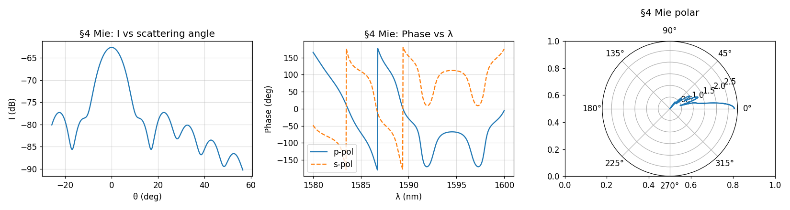
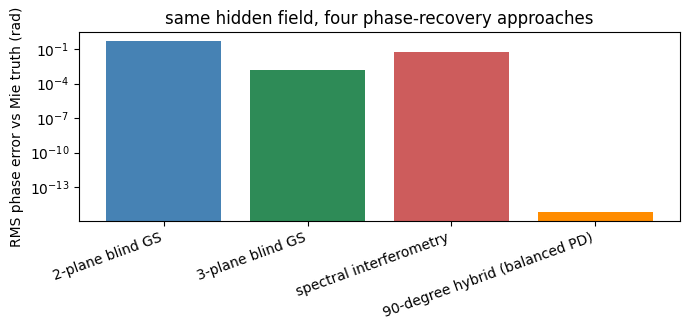
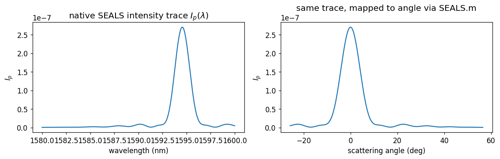
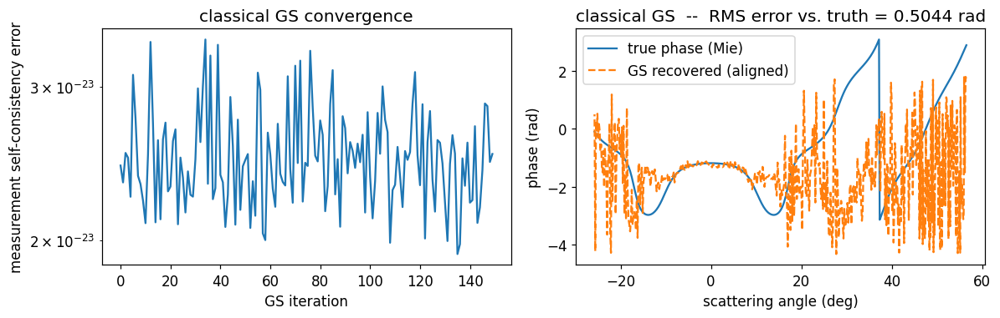
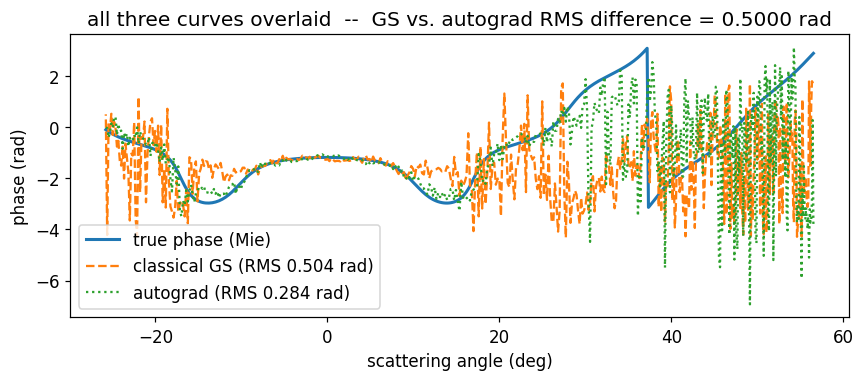
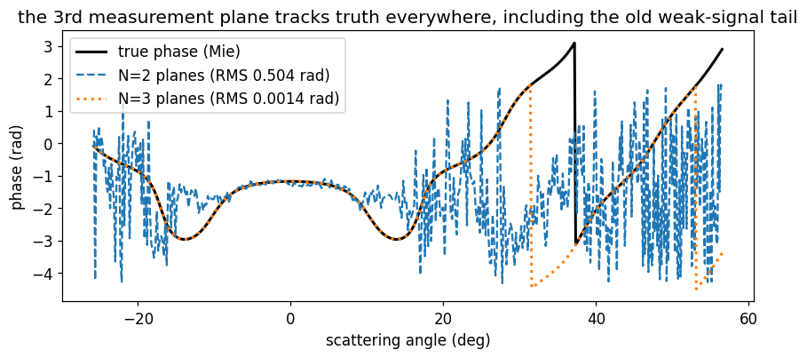
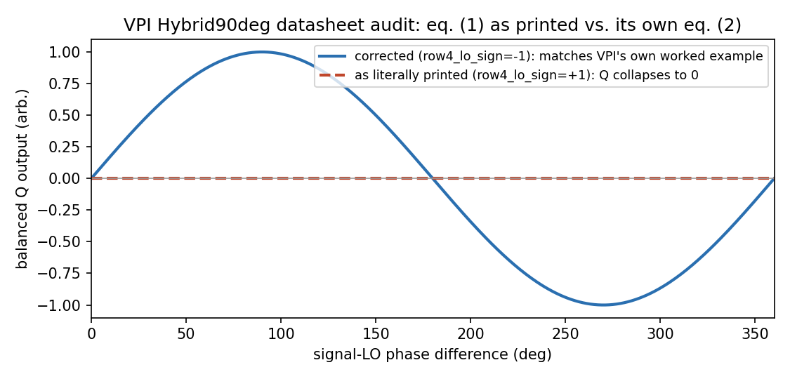
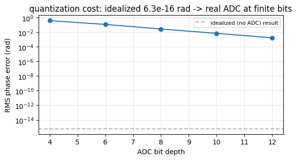

# Dispersion-Assisted GS Phase Recovery — Real-Scattering Validation

[](LICENSE)
[](pyproject.toml)
[](#funding-status)

Carrier-less optical phase retrieval — recovering φ(t) from two intensity-only
measurements, no local oscillator, no 90° hybrid — validated against **real Mie
scattering**, not just synthetic test signals, and cross-checked with an
independent second algorithm.

This branch is the technical case for that validation. For the course-context
version of this repo (ECE 279AS deliverable framing), see [`main`](../../tree/main).

> **Recruiters:** an interactive version of this page — same figures, plus a
> one-click switch to hide everything AI/ML-tagged and see the core
> physics/EE/hardware work on its own — is at
> [claude.ai/code/artifact/01376304-819d-4f62-a623-2b98e96d57ad](https://claude.ai/code/artifact/01376304-819d-4f62-a623-2b98e96d57ad).

## Contents

* [The problem](#the-problem-a-real-mie-scattering-signature)
* [Four ways to recover the same hidden phase](#four-ways-to-recover-the-same-hidden-phase)
* [Where the naive approach breaks — and how we know it's real](#where-the-naive-approach-breaks--and-how-we-know-its-real)
* [The fix](#the-fix-a-third-measurement-plane)
* [The hardware side](#the-hardware-side-a-receiver-not-just-an-algorithm)
* [Reproduce this](#reproduce-this)
* [Technology-area alignment](#technology-area-alignment)
* [Funding status](#funding-status)

---

## The problem: a real Mie scattering signature

Not a synthetic sinusoid — the actual intensity, phase, and angular pattern
of light Mie-scattered from a particle, computed by the SEALS physics engine
(`projects/seals/`). This is the hidden field every method below has to
recover phase for, seeing only intensity.

<p align="center">
  
</p>

A photodetector only ever records the left panel's intensity axis. The phase
(middle panel) is what every method here is trying to recover from
intensity alone.

---

## Four ways to recover the same hidden phase

Same hidden Mie field, four independent phase-recovery methods, compared
head-to-head on RMS phase error against the known Mie truth:

<p align="center">
  
</p>

The 90-degree hybrid wins because it has a known local oscillator — that's
the whole tradeoff this project is built around. The other three recover
phase from intensity *alone*, which is the harder, carrier-less problem this
repo targets (see [`dgs/optical_hybrid_90deg.py`](dgs/optical_hybrid_90deg.py)
for the hybrid, audited against VPIphotonics' own datasheet and shown to
contain a real internal sign inconsistency, not a convention choice).

---

## Where the naive approach breaks — and how we know it's real

The textbook two-plane GS algorithm, fed the *native* SEALS intensity trace
(not a synthetic stand-in):

<p align="center">
  
</p>

Classical 2-plane GS recovers the phase well near the scattering peak, then
diverges hard at wider angles (RMS error 0.504 rad):

<p align="center">
  
</p>

This is not blamed on numerics without proof — an independent method backs
it up. Click to expand (or collapse, if you'd rather see the classical-only
case for it):

<details open>
<summary><b>AI/ML-tagged:</b> independent PyTorch autograd cross-check</summary>

An independently-implemented PyTorch autograd solver, run on the identical
measurement, breaks down in the **same region** as classical GS:

<p align="center">
  
</p>

Two independent algorithms agreeing on where they fail is the signature of
a real information-theoretic limit in the two-plane measurement — not a bug
in either implementation.

</details>

Either way, the fix below is classical linear algebra, not a learned model —
it doesn't depend on the cross-check above being visible.

---

## The fix: a third measurement plane

Adding one more dispersed measurement plane (three total) resolves the
ambiguity almost completely — RMS error drops from 0.504 rad to 0.0014 rad,
including in the previously-broken weak-signal tail:

<p align="center">
  
</p>

That's a **~360×** reduction in phase error from one additional, physically
cheap measurement arm (`projects/seals/inverse/gs_multiplane.py`).

---

## The hardware side: a receiver, not just an algorithm

The classical alternative to blind phase retrieval is a 90°-hybrid
coherent receiver with a phase-locked local oscillator
(`dgs/optical_hybrid_90deg.py`) — real front-end hardware, not a simulation
shortcut. Building it against VPIphotonics' own Hybrid90deg datasheet
turned up a genuine bug: the datasheet's general transfer-matrix equation
(eq. 1) and its own worked ideal-case simplification (eq. 2), on the same
page, disagree on the 270° port's local-oscillator sign. Taken as printed,
eq. (1) produces a receiver that can never recover a Q quadrature — not a
typo, a self-contradiction in the primary source:

<p align="center">
  
</p>

That's the difference between a working receiver and a non-functional one,
traced to one sign in a datasheet equation — see
[`dgs/optical_hybrid_90deg.py`](dgs/optical_hybrid_90deg.py) for the
row-by-row derivation and `tests/test_optical_hybrid_90deg.py` for the
regression test that pins it down.

Either receiver design still has to survive real front-end electronics.
Feeding the recovered signal through a modeled photodetector,
transimpedance amplifier, and ADC (`dgs/transimpedance_amplifier.py`,
`dgs/adc.py`) shows the idealized, noise-free phase error (6.3×10⁻¹⁶ rad)
degrading by orders of magnitude once realistic ADC bit depth is accounted
for:

<p align="center">
  
</p>

Full chain (photodetector → hybrid → TIA → ADC) is in
[`notebooks/hybrid90deg_phase_retrieval_mie.ipynb`](notebooks/hybrid90deg_phase_retrieval_mie.ipynb).

---

## Reproduce this

```bash
pip install -r requirements.txt
pip install -e .
jupyter notebook projects/seals/seals_to_tdgsa_bridge.ipynb
```

The full step-by-step derivation — including the honest null result on
amplitude regularization and a historical cross-check against a known
even-degree phase ambiguity — is in that notebook. The 90-degree hybrid
comparison above is in
[`notebooks/hybrid90deg_phase_retrieval_mie.ipynb`](notebooks/hybrid90deg_phase_retrieval_mie.ipynb).

| File | What it is |
|---|---|
| [`projects/seals/`](projects/seals/) | SEALS Mie-scattering physics engine + the SEALS→TD-GSA inverse bridge |
| [`projects/seals/inverse/gs_multiplane.py`](projects/seals/inverse/gs_multiplane.py) | The N-plane GS extension that fixes the breakdown above |
| [`projects/seals/inverse/phase_retrieval.py`](projects/seals/inverse/phase_retrieval.py) | Independent PyTorch autograd solver, used as the cross-check |
| [`dgs/gs_core.py`](dgs/gs_core.py) | Classical two-plane TD-GSA engine |
| [`dgs/optical_hybrid_90deg.py`](dgs/optical_hybrid_90deg.py) | VPI-datasheet-audited 90-degree hybrid, the known-LO comparison point |
| [`dgs/sbir_portfolio.py`](dgs/sbir_portfolio.py) | The broader project portfolio this validation supports |

---

## Technology-area alignment

This validation work sits under the same OUSD(R&E) Critical Technology Area
mapping as the rest of the project — see [`main`](../../tree/main#ousdre-critical-technology-area-alignment)
for the full table (`FutureG`, `Trusted AI and Autonomy`,
`Advanced Computing and Software`, `Integrated Sensing and Cyber`,
`Directed Energy` [diagnostic use only], `Human-Machine Interfaces`,
`Quantum Science`, `Biotechnology`). Run `python dgs/ousd_alignment.py` for
the live, programmatically-generated table.

---

## Funding status

This is a UCLA / Jalali-Lab-adjacent academic project **pursuing SBIR Phase I
funding** — a proposal in progress, not an awarded contract. Nothing on this
page should be read as claiming DoD funding, sponsorship, or endorsement.
Marked **UNCLASSIFIED // DISTRIBUTION A — Approved for Public Release**.

The dispersive Fourier transform and time-domain GS concept originates from
the work of **Prof. Bahram Jalali** and his group at UCLA. This repository
is an independent implementation; it does not represent the lab's official
code or results. Errors are my own.
